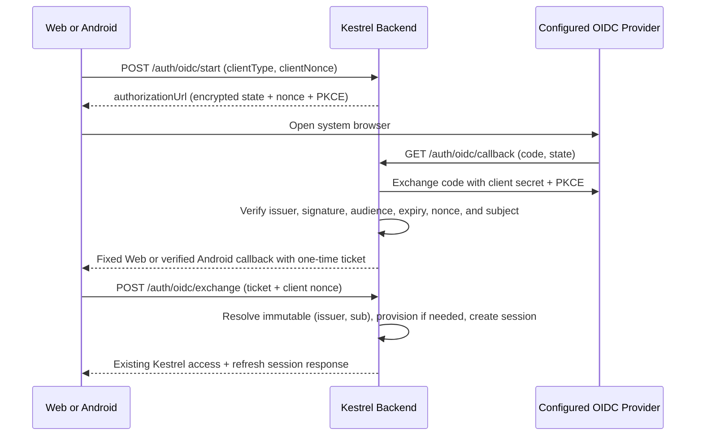

# Optional OpenID Connect Authentication Plan

## Goal

Add one optional, provider-neutral OpenID Connect sign-in method for Kestrel Web and Android while preserving local username/password, TOTP, recovery-code, refresh-token, session-revocation, sync, and remote-control behavior. Standard providers such as Pocket ID, Authentik, Keycloak, and Authelia should work through discovery without provider-specific code.

## Architecture

- OIDC is disabled unless every required `AUTH_OIDC_*` value is present and valid.
- Discovery supplies provider endpoints; no provider-specific endpoint or claim is required. `preferred_username` is optional for existing identities and required only to provision a new Kestrel username.
- Unauthenticated starts remain stateless. Authenticated-encrypted state carries PKCE verifier, client binding, client type, and expiry. Callbacks atomically claim the state hash before outbound provider requests, and successful verification completes that row for ticket exchange.
- The API exposes a configured display name but keeps one provider-neutral `oidc` method and route family.
- Web and Android redirects are fixed server configuration, never caller input. Android uses a verified HTTPS App Link compiled into the app; self-hosted forks must claim their own domain and configure the matching backend callback.
- Provider tokens remain backend-only. Clients receive only a short-lived, one-time Kestrel exchange ticket bound to their nonce.

## Non-Goals

- Supporting multiple simultaneous OIDC providers in one deployment.
- Automatically linking accounts by username or email.
- Provider-specific group, role, logout, or profile mapping.
- Replacing local authentication or password-based step-up.

## Risks

- Provider compatibility: require standard discovery, Authorization Code flow, PKCE S256, and signed ID tokens; fail closed on unsupported metadata or claims.
- Callback interception: require fixed HTTPS callbacks and a verified Android App Link.
- Mutable-claim takeover: identify accounts only by verified `(issuer, sub)` and reject username collisions.
- Configuration leakage or fork coupling: keep deployment-specific issuer, client ID, display name, and callback URLs out of tracked deployment defaults; keep client secret and flow key in secrets.
- Public callback resource exhaustion: require source-aware production ingress limits, skip storage for provider errors, and enforce serializable global rate/storage backstops before admitting code callbacks.
- Migration compatibility: add a forward migration that converts any development rows written as `pocket_id` to `oidc`; never rewrite committed migrations.

## Rollback / Recovery

- Remove any required OIDC setting to disable the method; local authentication and existing Kestrel sessions remain available.
- Do not delete provisioned users during rollback because they may own synced data.
- Before production migrations, follow `docs/operations.md` and take a verifiable database backup.

## Plan

- [x] Rename Backend service, routes, wire types, provider key, configuration, logs, and tests from Pocket ID to generic OIDC; 160 unit tests and 9 e2e tests pass.
- [x] Add a forward Prisma migration for the provider-key rename and removal of persisted raw recovery credentials; validate generated Prisma artifacts without rewriting prior migrations.
- [x] Atomically claim code callbacks before provider requests, bound claims to 120 new rows per minute and 1,000 active rows, use a bounded processing lease, fetch signing keys before code redemption, keep transient failures retryable, and audit recovered exchanges.
- [x] Derive reproducible callback/session retry secrets, preserve exact issuer identifiers and endpoint queries, support form-correct client authentication, and persist Android callback tickets through a cancellation-safe compare-and-set before serialized exchange.
- [x] Rename Web API helpers, callback route/component, storage keys, UI state, and labels; the configured provider name is displayed while local login remains available.
- [x] Rename Android models, API helpers, attempt store, callback parser, repository methods, UI state, and messages; callback binding and retry semantics remain covered by JVM tests.
- [x] Move all deployment-specific OIDC values to GitHub Actions variables, keep secrets in Actions secrets, and leave required Compose values empty so OIDC stays optional.
- [x] Replace Pocket ID-specific documentation with provider-neutral OIDC setup and include Pocket ID and Authentik examples plus Android App Link requirements.

## Completion Checklist

- [x] Backend lint, 160 unit tests, 9 e2e tests, typecheck, build, Prisma generation, and schema validation pass.
- [x] Web Biome CI, typecheck, and production build pass.
- [x] Android formatting, Detekt, JVM tests, and debug build pass without changing a connected device.
- [x] Production Compose validates with OIDC unset and with a complete generic OIDC configuration; Backend tests confirm incomplete or invalid configuration reports the method disabled.
- [x] Repository search finds no Pocket ID-specific code/API/config names or deployment-specific OIDC issuer, client ID, or callback defaults outside provider examples and immutable migration history.
- [ ] PR review feedback is refreshed and every new actionable item is addressed before reporting completion.
