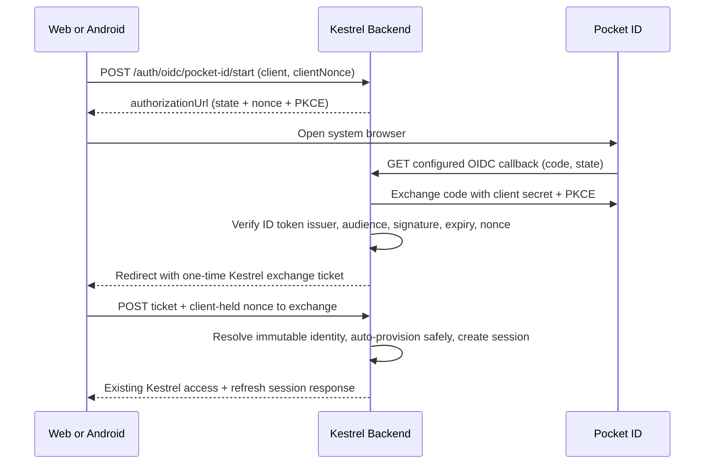

# Pocket ID Authentication Plan

## Goal

Add Pocket ID as an optional OpenID Connect sign-in method for Kestrel Web and Android while preserving existing username/password, TOTP, recovery-code, refresh-token, session-revocation, sync, and remote-control behavior.

## Context

- Kestrel currently issues its own access and rotating refresh tokens after local credential authentication.
- Pocket ID is an OpenID Connect provider. Its documented integration uses Authorization Code flow; Kestrel will use a confidential backend client plus PKCE.
- The selected account policy is additive auto-provisioning: identify Pocket ID users only by the verified `(issuer, sub)` pair, create a new Kestrel user on first sign-in, and never merge by username or email. A username collision must fail clearly rather than link accounts.
- Web and Android must receive the same Kestrel session format already used by sync and remote control. Pocket ID tokens must remain backend-only.

## Architecture

- Persist hashed authorization state, encrypted PKCE verifier, verified identity claims, hashed one-time exchange ticket, expiry, consumption state, and a short-lived encrypted Kestrel exchange result for response-loss recovery. Raw Pocket ID tokens are not persisted.
- Bind the final exchange to a client-generated nonce. Web stores it through the existing authentication-attempt mechanism; Android stores the nonce and returned exchange ticket in app-private preferences until completion so process recreation or an ambiguous network failure does not break the browser return.
- Redirect Web to a fixed configured HTTPS callback page and Android to the fixed `dev.narumi.kestrel://auth/pocket-id` deep link. Do not accept caller-controlled redirect URIs.
- Provision a Pocket ID-only user with an unusable random local password hash so existing non-null database and password-auth contracts remain compatible. Password login and username/email account merging remain unavailable for that user.

## Non-Goals

- Automatically linking an existing Kestrel account by username or email.
- Pocket ID single logout, back-channel logout, group/role mapping, or importing Pocket ID profile data beyond the username needed for display.
- Replacing or disabling local registration, password login, Kestrel TOTP, or recovery codes.
- Adding Pocket ID reauthentication as a replacement for existing current-password step-up. Pocket ID-only accounts can still revoke their current session through normal logout; password-protected revocation of other sessions/devices remains unavailable until a separately reviewed step-up design exists.

## Risks

- OAuth login CSRF or intercepted Android deep links: mitigate with high-entropy state, provider nonce, PKCE, a separate one-time exchange ticket, client-nonce binding, short expiry, atomic consumption, and same-client retry recovery.
- Account takeover through mutable claims: use only verified `issuer + sub` for identity and reject username collisions without linking.
- Open redirect or token leakage: use fixed callback destinations, put no Kestrel access/refresh or Pocket ID tokens in URLs, and redact OIDC secrets/tickets from logs.
- Provider outage or malformed discovery/JWKS data: fail closed without changing existing local authentication.

## Rollback / Recovery

- Disable Pocket ID by removing its backend environment configuration; local authentication and existing Kestrel sessions continue to work.
- The migration only adds identity/authorization tables and user relations. Do not remove provisioned users during rollback because they may own synced data.
- Before production migration, follow `docs/operations.md` and take a verifiable database backup.

## Plan

- [x] Add Prisma models and a versioned migration for immutable OIDC identities and short-lived authorization/exchange records; run `npm run prisma:generate` and inspect generated SQL.
- [x] Add a focused Pocket ID OIDC service that validates configuration and discovery, creates PKCE/state/nonce authorization requests, verifies callbacks and ID tokens, rejects unsafe username collisions, atomically consumes exchange tickets, and issues existing Kestrel sessions; cover success, replay, expiry, collision, issuer/audience/nonce, and disabled-config paths with unit tests.
- [x] Add public auth-method discovery plus Pocket ID start/callback/exchange routes without logging request bodies, query strings, secrets, provider tokens, or exact tickets; cover redirects and error handling with backend tests.
- [x] Add Web login initiation and a dedicated callback page that checks the existing authentication attempt, exchanges the one-time ticket, persists the Kestrel session through `AuthProvider`, and handles cancel/error/replay states.
- [x] Add Android browser initiation, app-private pending-attempt persistence, exact deep-link handling, ticket exchange, session persistence, sync-after-login, and user-visible cancel/error/replay states; cover URI validation with JVM tests and client-nonce binding with backend tests.
- [x] Document Pocket ID client setup, callback URL, required scopes, PKCE/confidential-client settings, environment variables, additive account semantics, collision behavior, and the password-step-up limitation in backend/Web/Android/operations documentation and deploy configuration.

## Completion Checklist

- [x] Backend lint, unit tests, e2e tests, typecheck, and build pass.
- [ ] Web formatting/lint, typecheck, and production build pass; Chrome DevTools verifies local login remains available and the Pocket ID start/callback UI has no console or accessibility regressions.
- [x] Android formatting, Detekt, JVM tests, and debug build pass without installing, clearing, or modifying a connected device.
- [x] Focused security review confirms immutable identity mapping, no username/email auto-link, PKCE/state/nonce checks, one-time atomic exchange, fixed redirects, bounded expiry, and secret-safe logs.
- [x] Repository diff contains no image binaries, generated build output, secrets, or unrelated changes.

Remaining verification: inspect the Web flow with Chrome DevTools and exercise the live Pocket ID callback after the production secrets are configured and deployment is explicitly authorized.
