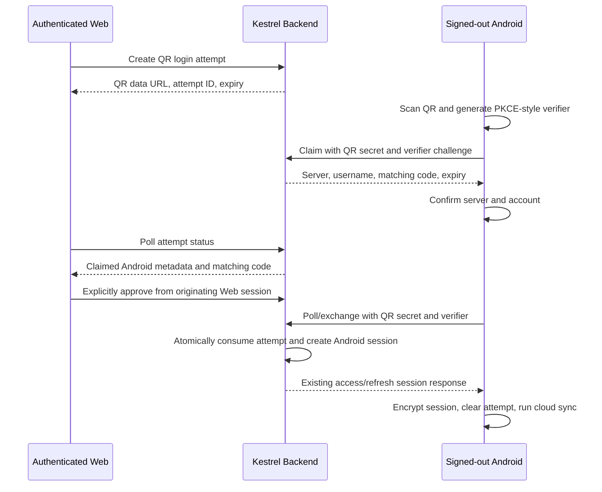

# Android QR Login Plan

## Goal

Allow a user with an authenticated Kestrel Web session to display a short-lived QR code, scan it from a signed-out Kestrel Android app, review the destination server/account on both devices, and create a new independent Android session without entering account credentials on Android.

Success means the QR carries no password, TOTP, access token, refresh token, or reusable session credential; Web and Android both confirm the same attempt; one approved attempt creates at most one retry-safe Android session; the session appears in existing account session management and remains independently revocable; and cloud sync starts without automatically enabling Web remote control.

## Context

- Backend already provides short-lived access tokens, rotating refresh tokens, server-side session revocation, auth audit logs, rate limiting, and owner-scoped session management.
- `backend/src/auth/oidc.service.ts` already implements one-time exchange tickets, client binding, atomic consumption, deterministic credential recovery, and response-loss retry behavior. QR login should reuse those security patterns rather than introduce a direct token-transfer path.
- Web already has an authenticated Account page with Active sessions, and Backend already depends on `qrcode` for TOTP QR generation.
- Android already maps the standard auth response to `CloudSession`, encrypts stored sessions through `CloudSessionStore`, pins OIDC attempts to their initiating server, and begins sync after interactive login.
- Android currently has no barcode-scanning dependency or camera permission. Google Code Scanner would avoid a camera permission but would introduce a Google Play services runtime dependency.
- This flow is informed by RFC 8628 device authorization security guidance, but Web initiates the QR and Android scans it, so it must be documented as a Kestrel cross-device login flow rather than standards-compliant OAuth Device Authorization Grant.

## Architecture

### Trust and state model

- The authenticated Web session creates an attempt bound to its `userId` and `sessionId`. Only that same active session may inspect, approve, deny, or cancel it.
- The QR payload uses a versioned HTTPS URL derived from configured `KESTREL_PUBLIC_URL`. Its fragment carries an opaque attempt ID and at least 256 bits of random QR secret so the secret is not sent in browser requests, query strings, or referrers.
- Android treats scanned text as untrusted data: it parses only the documented version/path, never opens arbitrary scanned URLs, derives the standard `${publicOrigin}/api/backend` endpoint, and requires a prominent server confirmation before changing the signed-out app's configured server.
- Android generates a high-entropy verifier and sends only its S256 challenge while claiming. A duplicate claim is idempotent only for the same QR secret/challenge; a competing challenge is rejected.
- Both clients display the same short matching code. Android also displays the server host and username; Web displays bounded, untrusted Android metadata. Android confirmation and explicit Web approval are both required before exchange.
- Attempt state advances monotonically through pending, claimed, approved or denied, and consumed; expiry is terminal. Compare-and-set updates and a serializable transaction prevent claim replacement, approval after cancellation, and duplicate session creation.
- Exchange creates a new `Session` with its own refresh credential and Android request metadata. It never copies the Web refresh token and does not register or enable a remote-control device.
- A lost exchange response can be retried with the same QR secret/verifier and recover the same session, including its current refresh credential during the bounded recovery window, following the existing OIDC exchange pattern.

### Backend data and API

Add an `AndroidLoginAttempt` model (exact field names may follow Prisma conventions) containing:

- owner user ID and originating Web session ID;
- QR-secret hash and Android verifier challenge;
- bounded Android device name/app version metadata;
- claim, approval, denial, consumption, expiry, and creation timestamps;
- exchange session ID for idempotent response recovery.

Raw QR secrets, verifiers, access tokens, and refresh tokens must not be stored in the attempt row. Expired rows are pruned with bounded work on attempt creation/claim, matching the existing OIDC cleanup approach.

Proposed route family:

- `POST /auth/android-login-attempts` — authenticated Web creation; returns QR data URL, attempt ID, and expiry.
- `GET /auth/android-login-attempts/:attemptId` — originating Web session status polling.
- `POST /auth/android-login-attempts/:attemptId/approve` — originating Web session approval.
- `POST /auth/android-login-attempts/:attemptId/deny` — originating Web session denial/cancellation.
- `POST /auth/android-login-attempts/:attemptId/claim` — Android claim with QR secret, verifier challenge, and bounded metadata.
- `POST /auth/android-login-attempts/:attemptId/exchange` — Android polling/exchange with QR secret and verifier; returns pending/denied/expired status or the existing auth-session response.

All responses use `Cache-Control: no-store`. Public claim/exchange endpoints have source-aware ingress guidance plus application backstops, minimum polling intervals, `Retry-After` where applicable, finite expiry, and generic terminal errors. `GET /auth/methods` exposes whether QR login is configured so clients do not show a dead entry point.

### Configuration and credential recovery

- QR login is disabled unless a valid `KESTREL_PUBLIC_URL` and a dedicated 32-byte `AUTH_ANDROID_QR_LOGIN_SECRET` are configured. Production public URLs require HTTPS; loopback HTTP remains development-only.
- The dedicated secret is used with explicit domain separation for matching-code and retry-safe exchange derivation. It is passed through development/production Compose and the deploy workflow but is never committed.
- Deployment remains backward-compatible when the secret is absent: existing login methods continue working and QR login reports disabled.
- Logger redaction explicitly covers QR secret, verifier, challenge, and any exchange credential names even though request logging already excludes bodies and query strings.

## Tech Stack

- Backend: Hono, Prisma/PostgreSQL, Node crypto, existing access-token/session/audit services, and existing `qrcode` package.
- Web: Next.js/React with existing Radix UI components and authenticated Account page patterns; no second QR or UI package.
- Android scanner recommendation: Google Code Scanner restricted to QR format, pending the first discovery task confirming Google Play services is an accepted runtime requirement. Keep scanner invocation behind an interface so parsing/repository behavior remains JVM-testable.
- Android auth: existing `CloudApiClient`, `CloudAuthRepository`, app-private pending-attempt persistence, `CloudSessionStore`, and existing sync trigger.

## Non-Goals

- Putting Web access/refresh tokens, passwords, TOTP secrets, or recovery codes in QR payloads.
- Logging Web into Android automatically on scan without Android account/server confirmation and Web approval.
- Replacing local password/TOTP/recovery-code or OIDC login.
- Automatically enabling remote control, creating remote commands, or permanently trusting an Android installation.
- Supporting generic third-party OAuth clients or claiming RFC 8628 compliance.
- Adding an Android session/device management UI, passkeys, push notifications, Bluetooth/NFC transfer, or a custom in-app camera UI in the first release.
- Deploying, setting GitHub secrets, or changing a physical device without separate explicit approval.

## Assumptions

- Production deployments use the supported Web origin with the runtime `/api/backend` proxy, so Android can derive the public API endpoint from `KESTREL_PUBLIC_URL`.
- QR login is offered only while Android is signed out. An existing Android session must be explicitly signed out before another account/server can be accepted.
- The first release can use polling rather than WebSocket, SSE, or FCM because attempts are user-initiated, short-lived, and rate-limited.

## Decisions

- The first release uses Google Code Scanner and therefore requires Google Play services only for the optional QR scan action. It adds no camera permission; devices without Google Play services retain local credential and OIDC login.
- Attempt creation requires the originating Web `Session.createdAt` to be no more than 10 minutes old. A stale session receives a generic reauthentication-required response and must complete the normal password or OIDC sign-in flow before creating a QR. The same still-active session must later approve; no separate password-only step-up is added, preserving OIDC-only account support.
- Supported production deployments expose the Backend at `${KESTREL_PUBLIC_URL}/api/backend`. Android derives exactly that API URL after confirming the scanned origin; QR payloads cannot provide an arbitrary API URL or path. Production requires HTTPS, while HTTP is accepted only for loopback development origins.

## Plan

- [x] Resolve the three material unknowns above before schema/API work: Google Code Scanner is optional-GMS-only with existing-login fallback; attempt creation requires a Web session created within 10 minutes; supported public API mapping is fixed to `${KESTREL_PUBLIC_URL}/api/backend` with loopback-only development HTTP.
- [x] Add the QR-login threat model and protocol contract to `docs/device-session-security.md`; review covers QR observation, remote phishing, login CSRF/account swapping, competing claims, stale/revoked Web sessions, fixed server mapping, response loss, replay, rate/storage abuse, bounded metadata, secret locations, and remote control remaining off.
- [x] Add `AndroidLoginAttempt` and its owner/origin/exchange relations to `backend/prisma/schema.prisma` with a new versioned migration, expiry/owner indexes, and cascade/set-null behavior that cannot preserve an approvable attempt after its authorizing session is revoked; acceptance is Prisma generation/validation plus fresh-database migration evidence.
- [x] Implement a focused Backend QR-login service that owns parsing, secret hashing/derivation, expiry/pruning, state transitions, same-session ownership, matching codes, atomic session creation, and retry recovery without expanding `AuthService`; acceptance is focused unit tests for every allowed/forbidden transition and concurrent claim/approve/exchange races.
- [x] Add Hono routes and method discovery for create/status/approve/deny/claim/exchange with `no-store`, bounded input, generic terminal errors, polling intervals, request metadata, and application rate/storage backstops; acceptance is route tests proving auth boundaries, status codes, headers, rate behavior, and no user/session enumeration.
- [x] Integrate QR-created sessions with existing access-token issuance, rotating refresh, audit, session listing, revoke, and save-failure cleanup semantics; acceptance is Backend tests proving a QR session is independent of the Web session, survives an ambiguous exchange retry without duplication, appears in `/auth/sessions`, and is immediately blocked after revoke.
- [x] Add QR credential names to logger redaction and audit create/claim/approve/deny/expiry/exchange outcomes without logging raw QR payloads, request bodies, exact secrets, or refresh credentials; acceptance is logger/audit tests and a repository search showing no secret-bearing log call.
- [x] Wire optional `AUTH_ANDROID_QR_LOGIN_SECRET` and the expanded `KESTREL_PUBLIC_URL` purpose through `compose.dev.yaml`, `compose.yaml`, Backend documentation, deploy workflow inputs, and operations guidance without setting remote secrets or enabling production externally; acceptance is Compose validation with QR login disabled and enabled using disposable local values.
- [x] Add Web API types/helpers and a focused Account-page QR-login panel using existing Radix components and Backend-generated QR data URLs; require an explicit start action, show account/expiry/pending/claimed/matching-code/approved/denied/error states, stop polling on terminal state/unmount/session change, and allow cancel; acceptance is component logic tests plus Web lint/typecheck/build.
- [x] Validate the Web flow with Chrome DevTools against a local real Backend: create, claim simulation, matching-code approval, denial, expiry, stale-session rejection, refresh/navigation cleanup, and concurrent-tab/session change; acceptance is request/DOM evidence at the repository's supported desktop viewport, with any screenshots kept outside the repository.
- [x] Add the selected Android scanner dependency and a QR-only scanner adapter; do not add `CAMERA` permission when Google Code Scanner is selected, and provide clear unavailable/download/cancel/failure states; acceptance is dependency inspection, manifest verification, and adapter-level tests where platform seams permit.
- [x] Add strict Android QR payload parsing and server/account confirmation that accepts only the documented version, HTTPS production origin/path, bounded attempt/secret values, and the resolved canonical API mapping; acceptance is JVM tests for malformed payloads, wrong paths/schemes, oversized values, server mismatch, loopback development cases, and valid production/self-host examples.
- [x] Add an app-private, expiry-aware QR attempt store and `CloudAuthRepository` workflow that serializes QR login with logout/OIDC/local login/server changes, pins every request to the scanned confirmed server, survives process death/ambiguous responses, stores the final session before clearing the attempt, and revokes a server-created session if local persistence fails; acceptance is repository/store unit tests modeled on current OIDC/session failure cases.
- [x] Add the signed-out Cloud settings entry point and Compose states for scan, server/account confirmation, matching code, waiting for Web approval, expiry/denial, retry, and success; keep existing signed-in, sync, OIDC, local login, and remote-control opt-in behavior unchanged; acceptance is Compose/JVM tests and Android screenshot-test coverage without committing new image binaries.
- [x] Add Backend e2e coverage for the complete two-client flow: authenticated Web creation, Android claim, code match, same-session approve, pending exchange, successful retry-safe session issuance, sync authorization, session listing/revocation, denial/expiry, foreign-session approval, stolen-QR competing claim, and concurrent exchange; acceptance is the Backend e2e suite passing with no raw token in persisted attempt fixtures or responses other than the final Android auth response.
- [ ] After explicit approval for connected-device state changes, run a scanner/login smoke on a disposable Google Play-enabled emulator (or the resolved non-GMS target), using a throwaway account and server; acceptance is scan through encrypted session persistence and sync, process-restart recovery, sign-out cleanup, remote control still disabled, and documented evidence that no physical device or retained app data was changed. **Blocked:** `adb devices` reports no attached device, `avdmanager list avd` reports no AVD, and the installed Android SDK has no system image; no physical device was changed.
- [x] Update `backend/README.md`, Android user guidance, operations/configuration guidance, and API/security documentation with enablement, fallback login methods, scanner dependency, expiry/approval UX, self-host mapping, audit/rate requirements, and rollback; acceptance is link/stale-wording review and consistency with actual routes/configuration.
- [x] Run all affected quality gates and record exact evidence in this plan: Backend format/lint/unit/e2e/typecheck/build and Prisma generation/validation; Web lint/test/typecheck/build; Android formatting/Detekt/JVM tests/screenshot verification/debug build; `git diff --check`; and intended-file/staged-image review.

## Verification Evidence

- Backend: `npx prettier --check 'src/**/*.ts' 'test/**/*.ts' && npm run lint && npm run test -- --runInBand && npm run test:e2e -- --runInBand && npm run typecheck && npm run build && npm run prisma:generate && npx prisma validate` passed; 24 unit suites/236 tests and 4 e2e suites/11 tests passed. An initial e2e run exposed the in-memory Prisma test double missing the new bounded-pruning `findMany`; the test double was corrected and the complete command then passed.
- Migration: a disposable `postgres:17-alpine` database applied all 19 migrations with `npm run prisma:migrate:deploy`; `npx prisma migrate status` reported the fresh schema up to date. The container was removed afterward.
- Web: `npx biome ci . && npm test && npm run typecheck && npm run build` passed; 30 tests passed, the Account route built, and Biome reported only the repository's 44 existing descending-specificity warnings.
- Browser: Chrome DevTools Protocol validation against a local real Backend/Web at 1280×900 covered `created`, `claimed`, `pending`, `approved`, `consumed`, `denied`, `expired`, and stale-session states; navigation and cross-tab session-change cleanup passed, and no QR secret appeared in network URLs. No repository screenshot was created.
- Android: `./gradlew spotlessCheck detekt :app:testDebugUnitTest :app:compileDebugScreenshotTestKotlin :app:assembleDebug` passed. `:app:updateDebugScreenshotTest :app:validateDebugScreenshotTest` also passed using temporary local references, which were deleted immediately; no image binary remains in the change.
- Configuration: production and development Compose models passed `docker compose ... config --quiet` with disposable disabled and enabled QR settings.
- Review: `git diff --check`, manifest CAMERA-permission search, Web browser-storage search, QR secret-bearing logger-call search, and working-tree image-extension review passed. All 57 intended files were explicitly staged; `git diff --cached --check` passed, the staged image-extension search was empty, and no unstaged or untracked file remained.
- Emulator: unavailable in this environment. `adb devices` listed no device, `avdmanager list avd` listed no AVD, and the SDK contains no system image. No connected or physical device state was changed.

## Risks

- A QR screenshot is a temporary bearer capability. Short expiry, hashed storage, claim binding, matching-code comparison, explicit Web approval, and Android account/server confirmation reduce but cannot eliminate real-time social engineering.
- A stolen active Web session could create persistent Android access. The first task must settle and enforce recent authentication or step-up rather than treating a long-lived refreshed session as fresh proof.
- A competing scanner can claim first and deny service to the legitimate phone. Claim replacement is forbidden; Web must show the claimed device/code and support denial plus generating a fresh attempt.
- Polling can amplify request volume. Attempts start only on user action, publish a minimum interval, return `Retry-After`, expire quickly, and receive both application and ingress limits.
- Response loss after session creation can leave an orphan session or duplicate sessions. Atomic attempt/session creation and bounded deterministic recovery must be tested under concurrency and refresh rotation.
- Google Code Scanner minimizes permissions but excludes devices without Google Play services. This compatibility choice must be resolved before dependency/UI work.
- Self-host server discovery can become an SSRF/phishing vector. Use configured public origins and a fixed proxy path; never let Backend fetch a scanned URL or let Android silently switch to an unconfirmed host.
- New auth-attempt rows and metadata are security/privacy data. Store only hashes and bounded device labels, prune expired rows, return them only to the originating session, and avoid location/fingerprinting data.

## Rollback / Recovery

- QR login remains optional and disabled when `AUTH_ANDROID_QR_LOGIN_SECRET` or valid public URL configuration is absent; local and OIDC login continue unchanged.
- The Web and Android entry points can be hidden through method discovery before Backend route removal. Existing QR-created sessions remain ordinary sessions and continue to refresh/revoke normally after feature disablement.
- Before production migration, follow `docs/operations.md` and obtain a verifiable database backup. Do not rewrite an applied migration.
- To roll back code, first disable attempt creation, allow or explicitly deny outstanding attempts until their short expiry, then remove client entry points and routes. The additive attempt table may remain harmlessly until a reviewed later migration removes it; do not delete active `Session` rows created through QR login.
- Secret rotation invalidates outstanding attempts/recovery but must not revoke completed Android sessions. Document rotation timing and wait beyond the maximum attempt/recovery lifetime before removing the previous deployment secret if dual-key recovery is not implemented.

## Completion Checklist

- [x] The approved threat model, scanner choice, reauthentication policy, and public API mapping are documented with no material unknown left open.
- [x] Migration and Backend tests prove owner/origin-session binding, short expiry, hashed credentials, matching-code confirmation, legal state transitions, atomic single-session issuance, retry recovery, rate limits, audit redaction, session listing, and revocation.
- [x] Web Account UI creates and controls QR attempts with accessible pending/approve/deny/error/expiry states and passes Chrome DevTools validation without leaking secrets into URL queries, storage, logs, or repository screenshots.
- [ ] Android scans only accepted QR payloads, clearly confirms host/account/code, safely persists/retries the attempt and final encrypted session, starts sync, leaves remote control disabled, and preserves existing local/OIDC login behavior.
- [x] Optional configuration is validated in disabled/enabled Compose models; documentation tells operators how to generate/set the secret, but no external secret, deployment, or production database is changed without explicit approval.
- [ ] Backend, Web, Android, migration, e2e, browser, approved disposable-emulator, diff, and binary-image checks all pass with exact evidence recorded in this plan.
